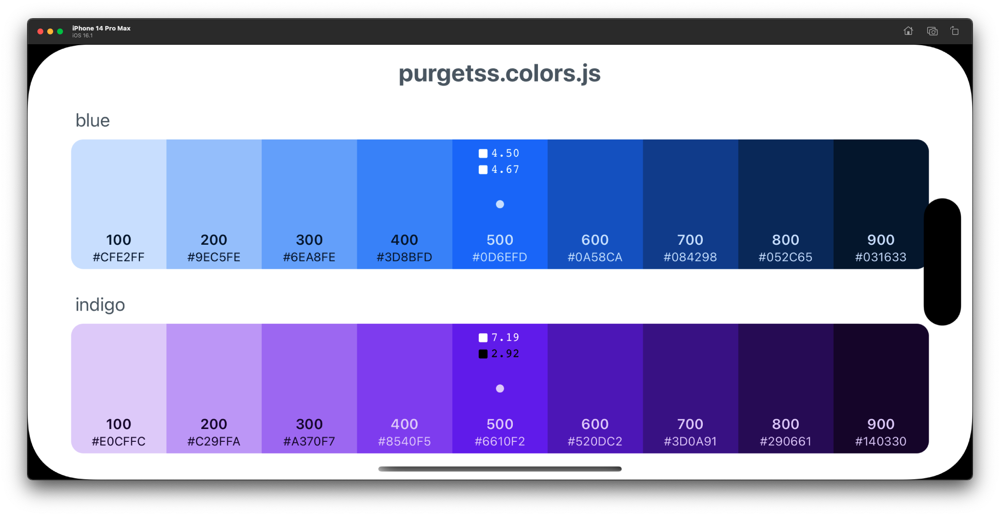

# Color Shades

## A [Titanium App](https://titaniumsdk.com) for iOS and Android, to showcase all the colors generated with the `shades` command in [PurgeTSS](https://github.com/macCesar/purgeTSS).

The App reads the `purgetss.colors.js` file (created with the `color-module` command) and displays all the colors and shades with their repective names and values.

Be sure to monitor contrast ratios as you customize colors. we’ve added two contrast ratios to each of the main colors, one for against white, and one for against black.


## How to use
First, make sure you have **PurgeTSS** installed globally on your machine:
```bash
> npm i -g purgetss
```

Then, download the App and run it on your device, or simulator.

## Add new colors

Add new shades of colors by running the `shades` command:
```bash
> purgetss shades [hexcode] [name]
```

```bash
# Example
> purgetss shades '#65e92c' Lima

::PurgeTSS:: All colors copied to lib/purgetss.colors.js
::PurgeTSS:: “Lima” (#65e92c) saved in config.js
```

It will add the following shades to `./purgetss/config.js` and to `./app/lib/purgetss.colors.js`:
```js
module.exports = {
  // ...
  theme: {
    extend: {
      colors: {
        // ...
        lima: {
          '50': '#f0fee7',
          '100': '#dcfdca',
          '200': '#bbfb9b',
          '300': '#90f561',
          '400': '#65e92c',
          '500': '#48d012',
          '600': '#34a60a',
          '700': '#297e0d',
          '800': '#246410',
          '900': '#215413',
          default: '#65e92c'
        }
      }
    }
  },
  // ...
}
```

Use the `-s, --single` option to generate a single color definition instead of shades of colors:
```bash
> purgetss shades 256427 -s

::PurgeTSS:: All colors copied to lib/purgetss.colors.js
::PurgeTSS:: “Green Pea” (#256427) saved in config.js
```

```js
module.exports = {
  // ...
  theme: {
    extend: {
      colors: {
        // ...
        'green-pea': '#256427'
      }
    }
  },
  // ...
}
```

Or create a random color by running the `shades` command without arguments:
```bash
> purgetss shades
```

All the colors generated with the `shades` command will be added in `config.js` and `purgetss.colors.js` files automatically.

## Add `purgetss.colors.js` to your project
To add the `purgetss.colors.js` file to your project, run the `color-module` command:
```bash
> purgetss color-module
```

It'll generate the `purgetss.colors.js` file in `./app/lib` folder, with all the colors from `config.js`.

## Bootstrap 5 Theme Colors
We've included the [Bootstrap 5 theme colors](https://getbootstrap.com/docs/5.2/customize/color/) in `./purgetss/config-bs5.js`.

To use them, replace the `colors` key in `./purgetss/config.js` and compile the App.


