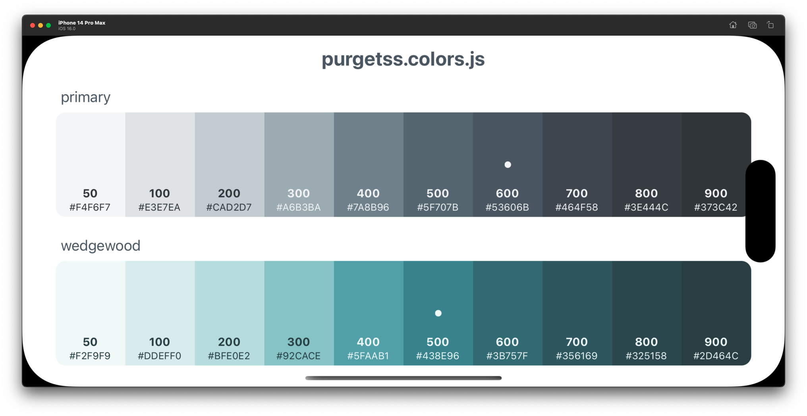

# Color Shades

## Is a very simple [Titanium App](https://titaniumsdk.com) for iOS and Android that showcase all the colors defined in `config.js` file created with [PurgeTSS](https://github.com/macCesar/purgeTSS)

`purgetss.colors.js` file was generated with the `color-module` command in **PurgeTSS**, and contains all the colors defined in `./purgetss/config.js` file.



The App reads the generated file and displays all the colors and shades with their repective names and values.

## How to use
Just download the App and run it on your device, or simulator.

## Add new colors

To add new colors you'll need to have **PurgeTSS** installed globally on your machine.

```bash
> npm i -g purgetss
```

Then you can add new shades of colors by running the `shades` command:
```bash
> purgetss shades [hexcode] [name]
```

```bash
# Example
> purgetss shades '#65e92c' Lima

::PurgeTSS:: All colors copied to lib/purgetss.colors.js
::PurgeTSS:: “Lima” (#65e92c) saved in config.js
```

It will add the following shades to `./purgetss/config.js` and to `./app/lib/purgetss.colors.js`:
```js
module.exports = {
  // ...
  theme: {
    extend: {
      colors: {
        // ...
        lima: {
          '50': '#f0fee7',
          '100': '#dcfdca',
          '200': '#bbfb9b',
          '300': '#90f561',
          '400': '#65e92c',
          '500': '#48d012',
          '600': '#34a60a',
          '700': '#297e0d',
          '800': '#246410',
          '900': '#215413',
          default: '#65e92c'
        }
      }
    }
  },
  // ...
}
```

Use the `-s, --single` option to generate a single color definition instead of shades of colors:
```bash
> purgetss shades bc560a -s
::PurgeTSS:: All colors copied to lib/purgetss.colors.js
::PurgeTSS:: “Vesuvius” (#bc560a) saved in config.js
```

```js
module.exports = {
  // ...
  theme: {
    extend: {
      colors: {
        // ...
        vesuvius: '#bc560a'
      }
    }
  },
  // ...
}
```

Or create a random color by running the `shades` command without arguments:
```bash
> purgetss shades
```

All the colors generated with the `shades` command will be added in `config.js` and `purgetss.colors.js` files automatically.

## Add `purgetss.colors.js` to your project
To add the `purgetss.colors.js` file to your project, just run the `color-module` command:
```bash
> purgetss color-module
```

It will copy the `purgetss.colors.js` file to the `./app/lib` folder, with all the colors defined in your `config.js` file.
